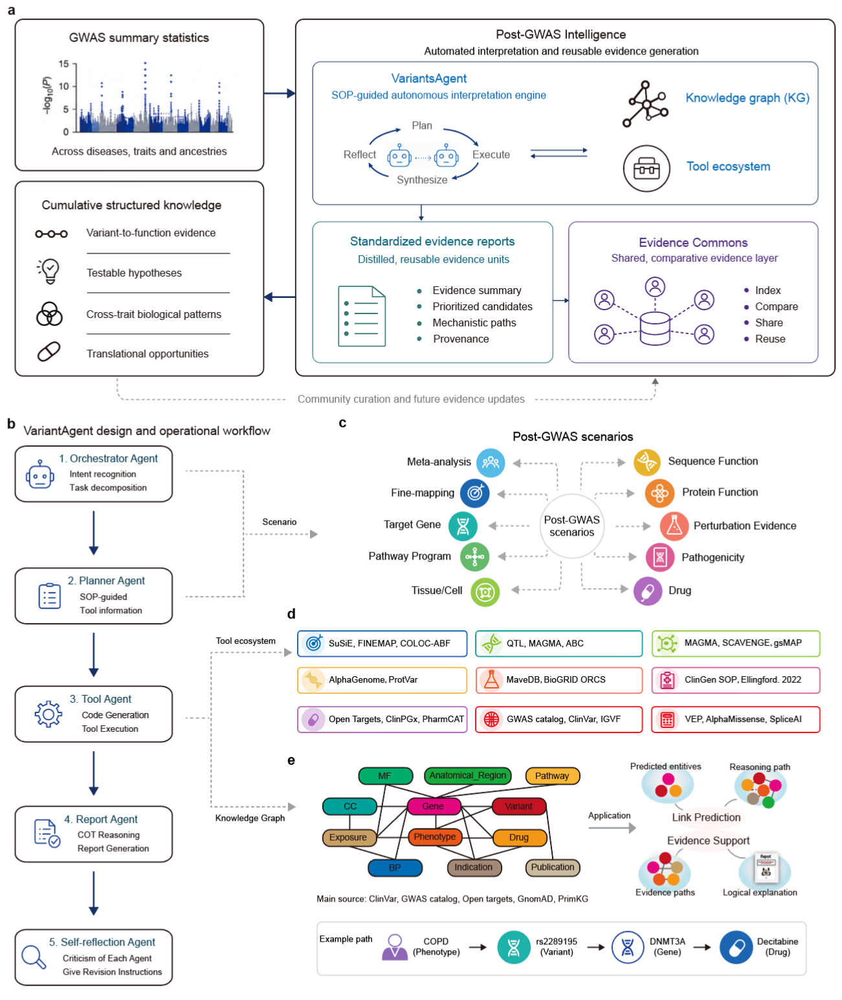

# PGI — Post-GWAS Intelligence

**Scaling genetic discovery through automated post-GWAS interpretation.**

Genome-wide association studies (GWAS) have made genetic *association discovery* routine, but not
yet *cumulative biological interpretation*. Post-GWAS Intelligence (PGI) is a framework that turns
isolated post-GWAS analyses into reusable, comparable and community-extensible biological
knowledge. It couples **VariantsAgent** (a SOP-guided autonomous interpretation engine),
**standardized evidence reports**, and a community-extensible **Evidence Commons** into a scalable
knowledge-production system for genetic discovery.

VariantsAgent automates ten common post-GWAS scenarios, linking loci to prioritized variants,
genes, regulatory contexts, cell types, pathways and testable hypotheses through traceable evidence
chains grounded in a variant-centric biomedical knowledge graph.



*PGI framework: (a) system overview — VariantsAgent turns GWAS summary statistics into standardized
evidence reports and a shared Evidence Commons, feeding cumulative structured knowledge; (b)
VariantsAgent's agent design and operational workflow; (c) the ten post-GWAS scenarios; (d) the
per-scenario tool ecosystem; (e) the variant-centric knowledge graph and example reasoning path.*

This repository hosts the **skill library** that operationalizes VariantsAgent: each skill is a
self-contained, SOP-driven module (a `SKILL.md` plus its analysis scripts) for one post-GWAS task.

## How it works

VariantsAgent runs as a coordinated multi-agent workflow:

- **Planner agent** — intent recognition, scenario classification and task decomposition; converts subtasks into executable workflows using post-GWAS SOPs and emits a structured JSON plan (tool order, parameters, dependencies).
- **Execution agent** — generates code and runs statistical-genetics / functional-genomics analyses in a sandbox, then synthesizes the standardized outputs into a structured report that separates direct database evidence, computational prediction and graph-inferred hypotheses.
- **Self-reflection agent** — critiques intermediate results, flags missing/inconsistent evidence and issues revision instructions for re-planning.

## Post-GWAS scenarios and skills

Each skill lives under [`skills/`](skills/). Skills are grouped by the analytical scenario they serve.

### Fine-mapping & meta-analysis
- `gwas-finemapping`, `gwas-finemapping-susie`, `gwas-finemapping-abf`, `gwas-finemapping-cojo`,
  `gwas-finemapping-finemap`, `gwas-finemapping-meta-susiex`, `gwas-finemapping-highconf-refalt`

### Target gene prioritization (variant-to-gene)
- `gwas-variant2gene`, `gwas-variant2gene-abc`, `gwas-variant2gene-qtl`, `gwas-variant2gene-magma`,
  `gwas-variant2gene-enrichment`, `gwas-variant2gene-harmonize`, `gwas-variant2gene-integration`
- `gwas-causal-gene`, `gwas-causal-gene-catalog`, `gwas-variant-mapped-gene`
- `gwas-gene-trait`, `gwas-gene-trait-exclusive`, `gwas-phenotype-variant-identification-weighted`

### Tissue & cell-context
- `gwas-variant2cell`, `gwas-variant2cell-gsmap`, `gwas-variant2cell-magma`, `gwas-variant2cell-scavenge`

### Sequence & protein function
- `gwas-variant2sequence-function`, `-vep`, `-spliceai`, `-alphagenome`, `-alphafold`, `-protvar`,
  `-mutpred2`, `-g2p`, `-clean`
- `gwas-alphamissense`

### Perturbation evidence
- `gwas-variant2perturbation`, `-crispr`, `-vep`, `-snpeff`

### Pathogenicity (ACMG / ClinGen-informed)
- `gwas-variant2acmg-pathogenicity`

### Drug & pharmacogenomic evidence
- `gwas-variant2drug`, `-opentargets`, `-chembl`, `-drugbank`, `-drugcentral`, `-clinpgx`

### Knowledge-graph reasoning
- `gwas-variant2kg`

### Orchestration
- `gwas-full-pipeline` — end-to-end planning blueprint for the full post-GWAS pipeline.
- `gwas-pipeline-team` — runs the complete pipeline end-to-end with a multi-agent team.
- `gwas-module-reflection` — module-level self-reflection / critique.

Tools invoked across scenarios include SuSiE, FINEMAP, COLOC-ABF, MAGMA, ABC, SCAVENGE, gsMAP,
AlphaGenome, AlphaMissense, VEP, SpliceAI, ProtVar, MaveDB, Open Targets, ClinPGx, PharmCAT,
GWAS Catalog, ClinVar and others.

## Repository layout

```
skills/                 # the VariantsAgent skill library (one directory per skill)
  <skill-name>/
    SKILL.md            # SOP + trigger conditions for the skill
    scripts/ or *.py    # analysis scripts the skill executes
    references/         # optional supporting docs
docker/                 # containerized environment (Dockerfile + conda/pip specs + CLEAN package)
pgi ms - Google 文档.pdf # manuscript draft describing PGI
```

Each skill is self-describing: read its `SKILL.md` for the exact trigger conditions, inputs, step
order, quality-control checks and expected outputs.

## Quick start

End-to-end: build the image → start a container → configure the model API inside the container
→ load the skills → drive the full post-GWAS pipeline from the agent with a single prompt.

### 1. Build the image

The full analytical stack (statistical genetics + functional genomics + multi-omics tools across
R and Python) is packaged as a Docker image with several isolated conda environments:
`canton`, `biopathnet`, `clean`, `enrich`, `gsmap_env`, `vep115`. The Dockerfile and its build
context (conda/pip environment specs + the CLEAN package) live under [`docker/`](docker/).

```bash
cd docker
docker buildx build \
  --platform linux/amd64 \
  --build-arg GITHUB_PAT=<your_github_pat> \
  -t post_gwas:v1 --load .
```

The base image `interndiscoveryscp/scp-code:v2` (which ships `cc-switch` and the `claude` CLI) is
public on Docker Hub and is pulled automatically during the build:

```bash
docker pull interndiscoveryscp/scp-code:v2   # optional; buildx pulls it anyway
```

> `GITHUB_PAT` is only needed to install a few R packages from GitHub during the build — supply
> your own and never commit a real token.

### 2. Start the container

Mount two host directories: a `workspace` that holds your GWAS summary statistics and receives all
results, and this repo's `skills/` so the agent can discover them. The skills mount target inside
the container decides the scope:

- **Option A — global** (available in every project): mount to `/root/.claude/skills`
- **Option B — project-scoped**: mount to `/workspace/your-project/.claude/skills`

```bash
docker run -d \
  --platform linux/amd64 \
  --shm-size=4g \
  -v /path/to/your/workspace:/workspace \
  -v /path/to/PGI/skills:/root/.claude/skills \
  --name gwas post_gwas:v2

docker exec -it gwas /bin/bash
```

Replace `/path/to/PGI/skills` with the skills directory of this repo on your host, and swap the
mount target for Option B if you prefer project-scoped skills. Your workspace should contain the
input data, e.g. `/workspace/100UKB/GCST90692996.h.tsv.gz`.

### 3. Configure the model API (cc-switch)

Inside the container, `cc-switch` manages the LLM provider used by the `claude` agent. Add a
provider interactively, then switch to it (see the
[cc-switch tutorial](https://github.com/InternScience/scp/blob/main/tutorial%20for%20skills.md)):

```bash
cc-switch --version           # verify it is installed
cc-switch provider add        # interactive: name, API key, base URL, model name
cc-switch provider list       # review configured providers (* = active)
cc-switch provider switch <id-or-name>
cc-switch provider current    # confirm the active provider
```

### 4. Load the skills

The skills are already available inside the container through the `-v` mount added in step 2 — no
copying needed. Verify they are discoverable:

```bash
ls /root/.claude/skills        # Option A (global); or your project's .claude/skills for Option B
```

The skills follow the standard `.claude/skills/` convention, so any compatible agent (not just the
`claude` CLI) can discover and run them.

### 5. Run the full post-GWAS pipeline

Launch the agent:

```bash
claude
```

Then paste an analysis prompt. `gwas-pipeline-team` is triggered by a "run the full pipeline"
request, orchestrating all modules end-to-end. Below is an **example** — replace every
placeholder (`<...>`) with your study's values:

````text
Run the full post-GWAS pipeline analysis.

## Analysis parameters
- Phenotype: `<phenotype, e.g. pain in throat and chest>`
- Population: `<population composition, e.g. mixed (420531 European + 8876 South Asian/Central Asian)>`
- Sample size N: `<sample size, e.g. 429407>`
- Reference genome: `<reference genome, e.g. GRCh38 / hg38>`

## Input data
- GWAS summary: `<path to GWAS summary file, e.g. /workspace/100UKB/GCST90692996.h.tsv.gz>`

## Output path
- Save all intermediate and final results to: `<output directory, e.g. /workspace/results/GCST90692996>`

## Constraints
- Do not read result files from any other task, phenotype or output directory during the analysis.
````

The agent plans the pipeline, executes each module (fine-mapping, variant-to-gene, tissue/cell,
sequence/protein function, perturbation, pathogenicity, drug, knowledge-graph reasoning),
self-reflects, and writes standardized evidence reports under the output path.


Most skills call public bioinformatics APIs (GWAS Catalog, Open Targets, Ensembl VEP, EFO/OLS)
and standard Python scientific packages.

## Benchmarks

VariantsAgent was evaluated on 313 questions spanning three categories — **gene-variant**,
**gene-phenotype** and **variant-phenotype** — drawn from published genetic-reasoning datasets
(GenomeArena, Biomni, SDE), scored via an LLM-as-a-judge protocol with majority voting over 5 runs.
All values below are accuracy (%); **N** is the number of questions; the best value in each row is
**bold**.

### Skills generalize across backbone models and agent harnesses

The PGI skills were run under two agent harnesses (**OpenCode** and **Claude Code**) on five backbone
models, and compared against each model with no skills (**plain LLM**). Model codes:

| Code | Model | Release |
|------|-------|---------|
| DS | deepseek-v4-pro | 2026-04-24 |
| QW | qwen-3.7-max | 2026-05-20 |
| KM | kimi-k2.6 | 2026-04-20 |
| CS | claude-sonnet-4-6 | 2026-02-18 |
| GPT | gpt-5.4 | 2026-03-05 |

*Column groups: **OC** = OpenCode + skills, **CC** = Claude Code + skills, **LLM** = model alone (no skills).*

| Category | Dataset | N | OC·DS | OC·QW | OC·KM | OC·CS | OC·GPT | CC·DS | CC·QW | CC·KM | CC·CS | CC·GPT | LLM·DS | LLM·QW | LLM·KM | LLM·CS | LLM·GPT |
|----------|---------|---|-------|-------|-------|-------|--------|-------|-------|-------|-------|--------|--------|--------|--------|--------|---------|
| gene-variant | GWAS+AM-set1 (GenomeArena) | 20 | **90** | **90** | **90** | **90** | **90** | **90** | **90** | **90** | **90** | **90** | 55 | 45 | 60 | 55 | 45 |
| | GWAS-set3 (GenomeArena) | 20 | **100** | **100** | **100** | **100** | **100** | **100** | **100** | **100** | **100** | **100** | 45 | 35 | 25 | 35 | 25 |
| gene-phenotype | GWAS+AM-set2 (GenomeArena) | 20 | 90 | 90 | 90 | 90 | 90 | 85 | 90 | 90 | 90 | **95** | 65 | 65 | 60 | 55 | 70 |
| | GWAS-set1 (GenomeArena) | 20 | **100** | 90 | **100** | 90 | 95 | 90 | 90 | 95 | 85 | 80 | 50 | 55 | 45 | 60 | 65 |
| | GWAS-set2 (GenomeArena) | 20 | 55 | 55 | 55 | 50 | 55 | **60** | 45 | 45 | **60** | **60** | **60** | 45 | 45 | 45 | 55 |
| | Causal-gene-1 (Biomni) | 50 | 64 | 68 | 74 | 66 | 64 | **76** | 66 | 64 | 66 | 66 | 56 | 56 | 54 | 58 | 62 |
| | Causal-gene-2 (Biomni) | 50 | 80 | 78 | 78 | 70 | 70 | 82 | 82 | **84** | 72 | 72 | 78 | 76 | 74 | 82 | 80 |
| | Causal-gene-3 (Biomni) | 50 | 86 | 88 | 88 | 88 | 88 | 86 | 88 | 88 | **90** | 84 | 64 | 72 | 68 | 72 | 74 |
| | Causal-gene-1 (SDE) | 20 | 70 | 75 | **80** | 70 | 70 | 70 | 70 | 70 | 70 | 65 | 45 | 50 | 60 | 55 | 60 |
| variant-phenotype | Variant Prioritization | 43 | 74.4 | 76.7 | 74.4 | 76.7 | 79.1 | 79.1 | **86.0** | 81.4 | 79.1 | 81.4 | 20.9 | 14.0 | 20.9 | 18.6 | 18.6 |
| **Average** | | 313 | 79.2 | 80.8 | **81.8** | 78.3 | 78.0 | **81.8** | 80.2 | 80.8 | 79.9 | 78.9 | 54.0 | 55.9 | 51.4 | 55.9 | 57.5 |

Skills lift every backbone by ~24-27 accuracy points on average over the plain LLM (e.g. deepseek-v4-pro:
54.0 → 81.8 with Claude Code + skills), and the effect holds across both harnesses.

### Framework ablation (deepseek-v4-pro backbone)

Fixing the backbone to deepseek-v4-pro, we ablate the skills within each harness and compare against
the Biomni agent baseline.

| Category | Dataset | N | OpenCode + skills | OpenCode | Claude Code + skills | Claude Code | DeepSeek (plain) | Biomni |
|----------|---------|---|-------------------|----------|----------------------|-------------|------------------|--------|
| gene-variant | GWAS+AM-set1 (GenomeArena) | 20 | **90** | 85 | **90** | 80 | 55 | **90** |
| | GWAS-set3 (GenomeArena) | 20 | **100** | 90 | **100** | **100** | 45 | **100** |
| gene-phenotype | GWAS+AM-set2 (GenomeArena) | 20 | **90** | **90** | 85 | 75 | 65 | 75 |
| | GWAS-set1 (GenomeArena) | 20 | **100** | **100** | 90 | 95 | 50 | **100** |
| | GWAS-set2 (GenomeArena) | 20 | 55 | 50 | 60 | 65 | 45 | **85** |
| | Causal-gene-1 (Biomni) | 50 | 64 | 66 | **76** | 62 | 56 | 26 |
| | Causal-gene-2 (Biomni) | 50 | 80 | 78 | **82** | 78 | 78 | 40 |
| | Causal-gene-3 (Biomni) | 50 | 86 | 80 | **88** | 68 | 64 | 26 |
| | Causal-gene-1 (SDE) | 20 | **70** | 65 | **70** | 65 | 45 | 15 |
| variant-phenotype | Variant Prioritization | 43 | 74.4 | **81.4** | 79.1 | 79.1 | 20.9 | **81.4** |
| **Average** | | 313 | 79.2 | 77.3 | **81.8** | 75.1 | 54.0 | 55.6 |

Across capability axes — workflow planning, statistical genetics, variant-to-gene mapping, mechanism
interpretation, evidence-chain reasoning and reproducibility — VariantsAgent (skills + agent harness)
outperforms both the plain-LLM and the tool-augmented Biomni baselines.

## Status

Research prototype accompanying the PGI manuscript. Interfaces and skills may change.
