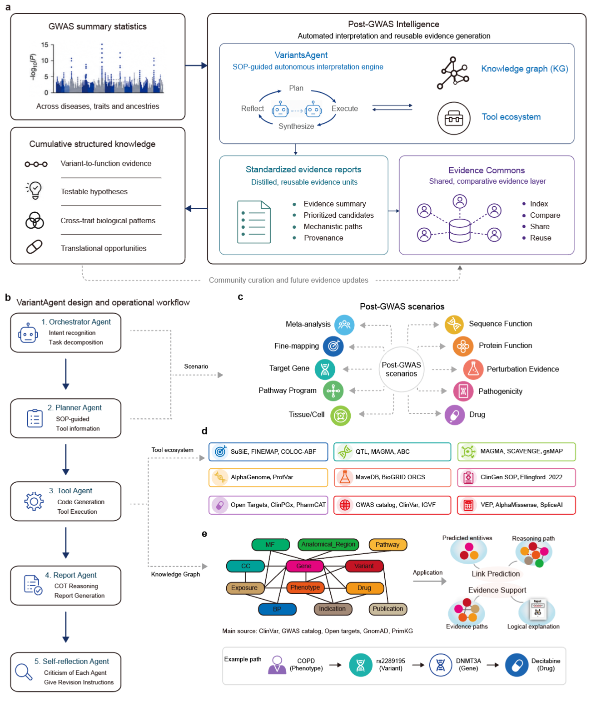

# Scaling genetic discovery through automated post-GWAS interpretation

**Post-GWAS Intelligence (PGI)** couples context-dependent post-GWAS analysis to a common, reusable
representation of the evidence it produces. Its multi-agent engine, **VariantAgent**, executes
domain-guided analytical workflows and records tool-derived results in standardized,
variant-centred evidence units — kept separate from, but linked to, the trait-level reports built
on top of them.

Genome-wide association studies (GWAS) have made genetic *association discovery* systematic and
cumulative, but the evidence used to *interpret* associated loci remains selective, heterogeneous
and difficult to accumulate across studies. PGI requires the post-GWAS evidence VariantAgent
produces — regardless of which analytical route a given study takes — to follow a common
structure, so that statistical estimates, molecular observations, computational predictions and
graph-nominated candidates remain distinguishable and comparable across studies and traits.

The generated variant-centred evidence catalogue and trait-level reports are available through
the [PGI portal](https://pgi.aigenomicsyulab.com/), together with an evidence-grounded
conversational interface for querying and synthesizing the accumulated post-GWAS evidence.

## How VariantAgent works



VariantAgent is a coordinated multi-agent architecture of five specialized agent types, run
through four Orchestrator-guided stages: **planning**, **module execution and reflection**,
**workflow-level reflection and revision**, and **reporting**.

- **Orchestrator** — centrally controls workflow execution: maintains the global workflow state
  and dynamically coordinates agent execution according to task dependencies and reflection
  outcomes.
- **Planner** — launched at workflow start; builds a structured execution plan specifying the
  analytical modules to run, their required inputs/outputs, and the dependencies that determine
  execution order.
- **Executor** — a fresh instance is assigned to each module whose dependencies are satisfied;
  performs the analysis and persists intermediate files, structured outputs and runtime logs as
  explicit workflow artifacts.
- **Reflector** — independently audits artifacts rather than trusting the Executor's self-reported
  completion state. At the **module level**, it checks artifact completeness, execution correctness
  and result validity, returning `PASS`, `NEED_REVISION` (triggers targeted re-execution by a newly
  instantiated Executor, up to 3 cycles per module) or `SKIP_WITH_REASON`. At the **workflow
  level**, once all modules reach a terminal state, it checks plan coverage, module dependencies
  and cross-module consistency, and can trigger further targeted re-execution.
- **Report Agent** — launched once the workflow passes workflow-level reflection; synthesizes the
  validated analytical artifacts and execution record into a traceable final report, preserving the
  link between reported conclusions and their underlying computational evidence.

To provide domain-specific guidance to both Executors and Reflectors, VariantAgent incorporates a
library of more than 40 task-specific skills, each specifying the analytical procedure, required
tools, expected outputs and quality criteria for a defined post-GWAS task. **This repository
release does not bundle that skill library** — see the Quick start section below for how to supply
your own.

Analytical modules span fine-mapping (ABF, SuSiE, FINEMAP, GCTA-COJO), variant-to-gene mapping
(MAGMA, molecular QTLs including eQTLGen and the eQTL Catalogue, ABC enhancer-gene links), cellular
context (SCAVENGE), sequence and protein-function prediction (VEP, SnpEff, SpliceAI, AlphaMissense,
FoldX, CADD), perturbation evidence, and drug/pharmacogenomic evidence (Open Targets, ChEMBL,
ClinPGx/PharmGKB, DrugCentral). All modules are indexed against a variant-centred knowledge graph,
**GWAS-KG** (implemented in Neo4j; 8,935,910 nodes across 12 entity types and 28,394,957
relationships across 47 relation types), used for entity alignment, evidence retrieval, candidate
linking and path construction.

## Benchmarks

*Numbers below are reported in the accompanying manuscript.*

**Answer-level accuracy.** VariantAgent was evaluated on 313 questions drawn from three published
genetic-reasoning benchmarks (GenomeArena, Biomni, SDE) against OpenCode, Tool Universe, Claude
Code and other tested systems, and ranked first or joint first on every constituent benchmark. The
raw question sets are published under [`benchmarks/`](benchmarks/).

**Recapitulating published findings, and going beyond them.** In matched reanalyses of 34
published GWAS spanning diverse diseases and quantitative traits, VariantAgent recovered the large
majority of directly comparable source-study findings. Uniform reanalysis also substantially
expanded downstream evidence relative to the source studies — across independent signals,
prioritized variants, prioritized genes, tissue or cellular contexts, mechanistic hypotheses,
perturbation-evidence records and pharmacological links — including regulatory relationships at
established risk loci not previously reported in the source studies.

**Analytical validity, not just answer accuracy.** On 26 study-specific questions requiring
analysis of supplied GWAS summary statistics, VariantAgent outperformed Biomni and Claude Code
under the open-answer protocol. Auditing whether the correct answer was also reached through a
valid analytical trace (target-method execution, critical harmonization, evidence-chain
completion, fallback recovery) showed VariantAgent maintaining substantially higher
**process-validated accuracy** than the other systems — the largest separation between systems
came from maintaining validity across the complete analytical chain, not from any single
operation.

**Scale.** Applied to 1,041 GWAS, VariantAgent generated 530,949 standardized variant-centred
evidence units together with trait-level evidence-synthesis reports, indexed by PGI across 370
traits.

## Status

Research prototype accompanying the PGI manuscript. Interfaces may change.

---

## Repository layout

```
docker/                 # containerized environment (Dockerfile + conda/pip specs + CLEAN package)
figure/                 # architecture diagram used in this README
benchmarks/             # raw benchmark question sets (CSV) referenced above
demo/                   # input download instructions, variant-centred evidence, and final reports
```

## System requirements

### Operating system and architecture

VariantAgent is distributed as a Docker-based environment targeting `linux/amd64`. Native
execution on other architectures has not been tested.

The recorded manuscript configuration and the host inspected for this release used:

- Host operating system: Ubuntu 20.04.4 LTS (Linux kernel 5.10.25)
- Architecture: x86_64 / amd64
- Docker Engine: 26.1.3 (client and server)
- Docker Buildx: v0.14.0
- Claude Code: 2.1.168
- cc-switch: 5.10.2
- Model backend used for the manuscript benchmarks: DeepSeek-V4-Pro
- Container base image: `interndiscoveryscp/scp-code:v2`

The Docker image contains the `canton`, `biopathnet`, `clean`, `enrich`, `gsmap_env`, and `vep115`
conda environments. The Dockerfile and exact conda, pip, R, and VEP dependency specifications are
provided under [`docker/`](docker/).

### Hardware

No specialized hardware is required for the demo.
Recommended:

- CPU: 32 logical CPUs on AMD EPYC 9654 processors
- RAM: 180 GiB
- GPU: none

Resource requirements for a full analysis depend strongly on GWAS size, the number and size of
fine-mapping loci, LD matrices, and which optional modules are enabled.

### Typical installation time

Building the Docker image from scratch takes approximately **150 minutes** on
the tested CPU and RAM configuration above, excluding variability in network download speed.

### Demo runtime

An end-to-end run of the included demo takes approximately **240 minutes** on
the tested CPU and RAM configuration above.

## Demo

The [`demo/09_TC_Sakaue_2021/`](demo/09_TC_Sakaue_2021/) example traces an East Asian total
cholesterol GWAS from the original summary statistics to 121 variant-centred evidence reports.
The original summary statistics can be downloaded from the GWAS Catalog using the link provided
in the demo README. The repository includes the resulting evidence units and final
variant-gene-mechanism report.

## Quick start

End-to-end: build the image → start a container → configure the model API inside the container
→ (optionally) load a skill library → drive the full post-GWAS pipeline from the agent with a
single prompt.

### 1. Build the image

Build the Docker environment described under [System requirements](#system-requirements). The
Dockerfile and its build context live under [`docker/`](docker/).

```bash
cd docker
docker buildx build \
  --platform linux/amd64 \
  --build-arg GITHUB_PAT=<your_github_pat> \
  -t post_gwas:v1 --load .
```

The base image `interndiscoveryscp/scp-code:v2` (which ships `cc-switch` and the `claude` CLI) is
public on Docker Hub and is pulled automatically during the build:

```bash
docker pull interndiscoveryscp/scp-code:v2   # optional; buildx pulls it anyway
```

> Supply your own `GITHUB_PAT` and never commit a real token.

### 2. Start the container

Mount a `workspace` that holds your GWAS summary statistics and receives all results. To use a
compatible skill library, mount it so the agent can discover it. The mount target determines its
scope:

- **Option A — global** (available in every project): mount to `/root/.claude/skills`
- **Option B — project-scoped**: mount to `/workspace/your-project/.claude/skills`

```bash
docker run -d \
  --platform linux/amd64 \
  --shm-size=4g \
  -v /path/to/your/workspace:/workspace \
  -v /path/to/your/skills:/root/.claude/skills \
  --name gwas post_gwas:v1

docker exec -it gwas /bin/bash
```

Omit the second `-v` mount entirely if you have no skill library to supply. Swap the mount target
for Option B if you prefer project-scoped skills. Your workspace should contain the input data,
e.g. `/workspace/100UKB/GCST90692996.h.tsv.gz`.

### 3. Configure the model API (cc-switch)

Inside the container, `cc-switch` manages the LLM provider used by the `claude` agent. Add a
provider interactively, then switch to it (see the
[cc-switch tutorial](https://github.com/InternScience/scp/blob/main/tutorial%20for%20skills.md)):

```bash
cc-switch --version           # verify it is installed
cc-switch provider add        # interactive: name, API key, base URL, model name
cc-switch provider list       # review configured providers (* = active)
cc-switch provider switch <id-or-name>
cc-switch provider current    # confirm the active provider
```

### 4. Load the skills (optional)

If you mounted a skill library in step 2, it's already available inside the container through
that `-v` mount — no copying needed. Verify it's discoverable:

```bash
ls /root/.claude/skills        # Option A (global); or your project's .claude/skills for Option B
```

### 5. Run the full post-GWAS pipeline

Launch the agent:

```bash
claude
```

Then paste an analysis prompt. If you supplied a skill library that includes an orchestration
skill (e.g. `gwas-pipeline-team`), a "run the full pipeline" request triggers it, orchestrating
all modules end-to-end. Below is an **example** — replace every placeholder (`<...>`) with your
study's values:

````text
Run the full post-GWAS pipeline analysis.

## Analysis parameters
- Phenotype: `<phenotype, e.g. pain in throat and chest>`
- Population: `<population composition, e.g. mixed (420531 European + 8876 South Asian/Central Asian)>`
- Sample size N: `<sample size, e.g. 429407>`
- Reference genome: `<reference genome, e.g. GRCh38 / hg38>`

## Input data
- GWAS summary: `<path to GWAS summary file, e.g. /workspace/100UKB/GCST90692996.h.tsv.gz>`

## Output path
- Save all intermediate and final results to: `<output directory, e.g. /workspace/results/GCST90692996>`

## Constraints
- Do not read result files from any other task, phenotype or output directory during the analysis.
````

The agent plans the pipeline, executes each module (fine-mapping, variant-to-gene, tissue/cell,
sequence/protein function, perturbation, pathogenicity, drug, knowledge-graph reasoning),
self-reflects, and writes standardized evidence reports under the output path.

## License

The software and original project documentation are available under the [MIT License](LICENSE).
Third-party datasets retain their source-specific terms.
